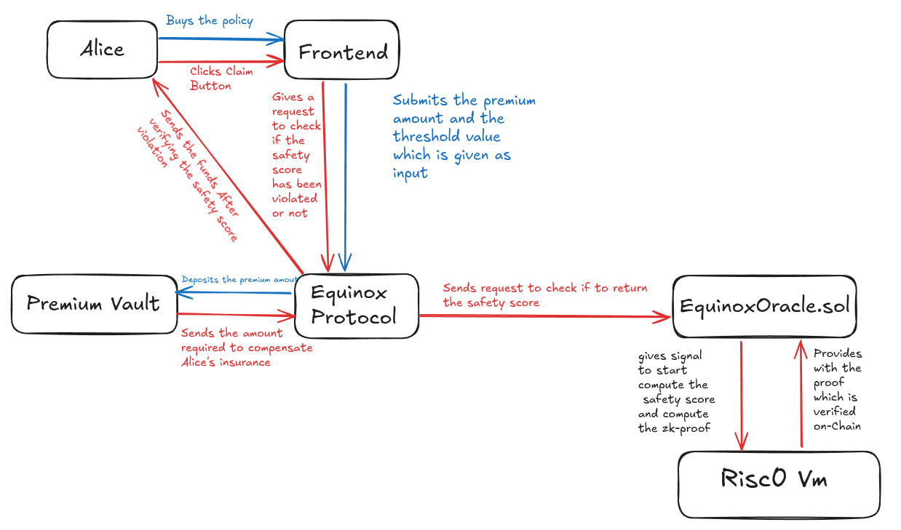

# Equinox - Parametric DeFi Insurance

<h4 align="left">
  A Decentralized Insurance Protocol 
</h4>

DeRisk is a decentralized, non-custodial, and trustless insurance protocol for DeFi assets. It protects users from protocol solvency risk using a "zk-Oracle" to trigger automated, instant payouts (currently manual).

This project was built for the [BlockSoc-Residency-TriHackathon] (2025).

## 1. The Problem

DeFi is risky. When you deposit into a high-yield protocol, you are exposed to "black swan" events:

Smart Contract Bugs: A novel hack or exploit.

Bad Debt: A market crash so fast that liquidations fail, making the protocol insolvent.

Slashing: For Liquid Restaking Tokens (LRTs), this is a massive, unhedged risk.

Traditional DeFi insurance is slow, manual, and centralized. It requires filing a claim and trusting a committee to vote on your payout.

## 2. The Solution: DeRisk Protocol

DeRisk is parametric insurance. It doesn't use claim forms. It uses math.

The protocol is built on a simple, automated trigger:

if (Protocol_Safety_Score < Your_Policy_Strike_Score) => Payout_Is_Enabled

Core Features

Parametric Payouts: Automatically triggered by on-chain data, not a claims committee (Currently It Checks Safety Score on Manual Click of user to claim insurance).

Trustless Oracle: Uses a zk-Oracle (powered by RISC Zero) to verifiably compute a protocol's safetyScore (e.g., (Assets - Liabilities) / Assets) off-chain. This makes the trigger trustless.

Non-Custodial: All funds are held in the PremiumVault smart contract.

Permissionless: No KYC. Anyone can buy a policy.

Tokenized Policies: Policies are minted as EIP-1155 NFTs. You can hold them, trade them, or use them as collateral

## Address of Deployed And Verified Contracts:
MockUSDC: 0xd06Bd4495e0FE6d7d537a3DF014B6ABf401bf581
Oracle: 0x613fbaA88E221407248E4831f927875c0a68D3C5
PremiumVault: 0xf2538f7DE80442DF33055213dcc09d20825c58ef
EquinoxProtocol: 0xDD19349a861D4Fc093168fA843A975aC774bd2e9

## Features

- **Smart Insurance Contracts**: Robust and auditable insurance policies powered by Solidity
- **Premium Management**: Advanced vault system for premium calculations and management
- **Oracle Integration**: Real-time data feeds for accurate risk assessment
- **Multiple Frontend Options**: Choose between Vite-based React or Next.js implementations
- **Risk Assessment Engine**: Powered by Rust for high-performance risk calculations
- **Secure Wallet Integration**: Seamless connection with various wallet providers
- **Policy Management Dashboard**: User-friendly interface for managing insurance policies

## Project Structure

The project is organized into several key packages:

### Foundry Package (`/packages/foundry`)

- Smart contract development and testing environment
- Core contracts including:
  - `Equinox.sol`: Main protocol contract
  - `PremiumVault.sol`: Insurance premium management
  - `Oracle.sol`: Price feed and data oracle
- Testing and deployment scripts

### Frontend Package (`/packages/frontend`)

- Modern React frontend built with Vite
- Features:
  - Policy management interface
  - Real-time premium calculations
  - Wallet integration
  - Responsive design with Tailwind CSS

### Next.js Package (`/packages/nextjs`)

- Alternative frontend implementation using Next.js
- Includes:
  - Block explorer integration
  - Debug interface
  - Scaffold-ETH components
  - Web3 service integrations

### RiskZero Package (`/packages/riskZero`)

  - 1. The Guest Program (Rust - runs in zkVM)
This is the actual computation logic that runs inside the RISC Zero zero-knowledge virtual machine.
Location: methods/guest/src/main.rs (RISC Zero convention)
What it does:

Receives input data (protocol addresses, RPC endpoint data)
Executes the safety score calculation logic
Commits the final result to a "public journal" (this is what goes on-chain)
The zkVM automatically generates a cryptographic proof (the "seal") of this execution

Key Concept: This program runs in a sandboxed, deterministic environment. Every single instruction is traced and proven. The resulting "seal" is a ZK-STARK that cryptographically proves "this exact code was executed with this input, producing this output."

- 2. The Host Program (Rust - runs off-chain)
This is the orchestrator that runs on a normal server/computer.
Location: host/src/main.rs
What it does:

Fetches real-time data from the blockchain (via RPC calls to Aave contracts)
Prepares this data and passes it as input to the guest program
Executes the guest program inside the RISC Zero zkVM
Receives back:

The journal (public output - the safety score)
The seal (the ZK proof)


Submits these to your EquinoxOracle.sol smart contract

Key Concept: The host is "untrusted" - it could be run by anyone. The blockchain doesn't trust the host; it only trusts the cryptographic proof the host provides.

## System Architecture

This project consists of 3 core smart contracts and a frontend:

DeRiskProtocol.sol (EIP-1155): The main logic contract. Handles buyPolicy and claimPayout. Mints/burns the policy NFTs.

PremiumVault.sol (EIP-4626): A tokenized vault that holds all incoming premiums (USDC). It can earn yield on these premiums while they are not being used for claims.

DeRiskOracle.sol: The oracle. Stores the safetyScore for all insured protocols.

Frontend (React/Vite/Wagmi): The dApp that allows users to interact with the contracts.

RiscZero Contracts:  Compute and Generate Generate 





### Prerequisites

- Node.js (>= v20.18.3)
- Yarn (v1 or v2+)
- Rust toolchain
- Foundry for smart contract development

### Installation

1. Clone the repository:

```bash
git clone https://github.com/0xsamalt/Equinox.git
cd Equinox
```

2. Install dependencies for all packages:

```bash
# Install root dependencies
yarn install

# Install Foundry dependencies
cd packages/foundry
forge install

# Install frontend dependencies
cd ../frontend
yarn install

# Install Next.js dependencies
cd ../nextjs
yarn install
```

3. Set up environment variables:

- Copy `.env.example` to `.env` in relevant packages
- Configure your environment variables

### Development

#### Smart Contracts (Foundry)

```bash
cd packages/foundry
forge build
forge test
```

#### Frontend (Vite)

```bash
cd packages/frontend
yarn dev
```

#### Next.js Frontend

```bash
cd packages/nextjs
yarn dev
```

## 📖 Documentation

Detailed documentation for each component can be found in their respective directories:

- Smart Contracts: See `packages/foundry/README.md`
- Frontend: See `packages/frontend/README.md`
- Next.js: See `packages/nextjs/README.md`
- Risk Assessment: See `packages/riskZero/ARCHITECTURE.md`

## Contributing
Made with love team Equinox

## 🔗 Links

- [GitHub Repository](https://github.com/0xsamalt/Equinox)
- [Architecture Overview](packages/riskZero/ARCHITECTURE.md)
